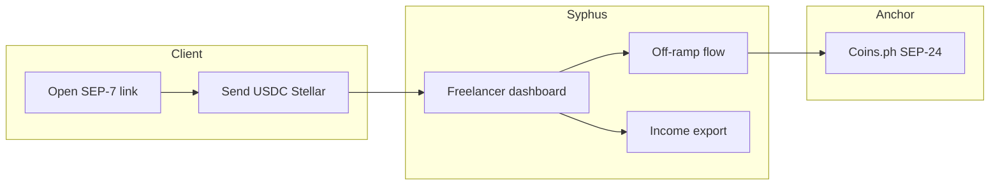

# Product Requirements Document (PRD)

**Project:** Syphus
**Date:** 2026-07-06
**Version:** 1.0
**Owner:** Project team
**Status:** Locked
**Last reconciled:** 2026-07-06
**Sources:** [idea-syphus.md](idea-syphus.md), [brd-syphus.md](brd-syphus.md), [scrutiny-syphus.md](scrutiny-syphus.md)

---

## 1. Product Purpose & Value Proposition

**Purpose:** Give crypto-native payers and PH freelancers a purpose-built USDC payment rail on Stellar with invoice links, same-day PHP off-ramp, and exportable income history.

**UVP:** "Pay your PH team in USDC with one link. They get PHP today and a income record that builds itself."

**Not our job:** Beat Wise or Higlobe on fiat-client remittance rates.

---

## 2. Target Personas

| Persona | Role | Primary need |
|---------|------|--------------|
| Maria | PH senior developer, USDC-paid | Fast off-ramp + income PDF |
| Alex | Crypto agency ops lead | Batch payout + reconciliation |
| Jordan | Web3 startup finance | SEP-7 invoice links from treasury |

---

## 3. Core Features & Priorities

| ID | Feature | Description | Priority |
|----|---------|-------------|----------|
| PRD-F1 | Freelancer wallet & address | Register, KYC hook, Stellar address + USDC trustline setup | Must-Have |
| PRD-F2 | SEP-7 payment link | Generate shareable payment request URI / QR for clients | Must-Have |
| PRD-F3 | Anchor off-ramp | SEP-24 flow to Coins.ph (BCRemit fallback) for PHP withdrawal | Must-Have |
| PRD-F4 | Income history export | Dashboard of inbound USDC; CSV/PDF export for 6 months | Must-Have |
| PRD-F5 | Agency batch payout | CSV upload → multiple SEP-7 requests + reconciliation view | Should-Have |
| PRD-F6 | Client checkout page | Branded "Pay [Name] in USDC" public page | Should-Have |
| PRD-F7 | Multi-corridor modules | IN, NG, LATAM anchor swap | Won't-Have (v1) |
| PRD-F8 | Platform withdrawal | Upwork/Fiverr faster payout | Won't-Have (v1) |
| PRD-F9 | On-chain payment registry | Soroban attestation for links and batches; settlement marking | Must-Have (hackathon) |

---

## 4. User Stories & Acceptance Criteria

### PRD-F1: Freelancer wallet & address

**US-1:** As Maria, I create an account and receive a Stellar address so clients can pay me USDC.

| AC | Criterion |
|----|-----------|
| AC-1.1 | Account creation with email + password; session auth required |
| AC-1.2 | System provisions or links Stellar keypair; displays public address |
| AC-1.3 | USDC trustline established or guided before first receive |
| AC-1.4 | KYC status shown; off-ramp blocked until anchor KYC complete |

### PRD-F2: SEP-7 payment link

**US-2:** As Jordan, I open Maria's payment link and pay 500 USDC from Coinbase Stellar.

| AC | Criterion |
|----|-----------|
| AC-2.1 | Freelancer generates link with amount (optional) and memo |
| AC-2.2 | Link encodes valid SEP-7 URI scannable by Lobstr/Freighter/Coinbase |
| AC-2.3 | Inbound payment credits dashboard within 30 seconds of Stellar confirmation |
| AC-2.4 | Wrong memo or network rejected with clear error (client-side guidance) |

### PRD-F3: Anchor off-ramp

**US-3:** As Maria, I withdraw USDC to GCash PHP same day.

| AC | Criterion |
|----|-----------|
| AC-3.1 | Off-ramp initiates SEP-24 interactive flow to Coins.ph |
| AC-3.2 | User completes anchor KYC if not already done |
| AC-3.3 | PHP received within 24h under normal anchor ops |
| AC-3.4 | Failed anchor redirects to BCRemit fallback or shows pause banner |

### PRD-F4: Income history export

**US-4:** As Maria, I export a 6-month income PDF for BIR documentation.

| AC | Criterion |
|----|-----------|
| AC-4.1 | Dashboard lists all inbound USDC with date, amount, sender address, tx hash |
| AC-4.2 | CSV export downloads filtered date range |
| AC-4.3 | PDF export includes summary totals and transaction table |
| AC-4.4 | Export excludes pending/unconfirmed payments |

### PRD-F9: On-chain payment registry

**US-5:** As Jordan, I see a payment link registered on Stellar Soroban so clients can verify the invoice was not tampered with.

| AC | Criterion |
|----|-----------|
| AC-9.1 | Payment link creation invokes `register_link` when Soroban is enabled |
| AC-9.2 | Agency batch creation invokes `register_batch` when Soroban is enabled |
| AC-9.3 | Indexer marks link paid on-chain when inbound memo matches slug |
| AC-9.4 | Checkout page shows on-chain verification when link status is `paid` |
| AC-9.5 | Soroban disabled or RPC failure does not block SEP-7 link creation |

---

## 5. App Flow & UX Intent

| Destination | Label | Screen | Route | Auth | PRD-F# |
|-------------|-------|--------|-------|------|--------|
| Home | Dashboard | Payment history | `/dashboard` | Yes | PRD-F4 |
| Pay | Payment link | Generate / share link | `/pay/link` | Yes | PRD-F2 |
| Withdraw | Off-ramp | Anchor withdrawal | `/withdraw` | Yes | PRD-F3 |
| Export | Reports | CSV/PDF export | `/export` | Yes | PRD-F4 |
| Public | Checkout | Client payment page | `/p/:slug` | No | PRD-F2, PRD-F9 |
| Onboard | Setup | Wallet setup | `/onboard` | Yes | PRD-F1 |

---

## 6. Out of Scope for This Release

- Fiat-client onboarding (Higlobe/Wise corridor)
- Upwork API integration (PRD-F8)
- Multi-corridor (PRD-F7)
- Tax filing to BIR

**Note (2026-07-10):** PRD-F5 agency batch payout, previously deferred to v1.1, was pulled forward and implemented (CSV upload, multi-link generation, reconciliation view) alongside the Must-Haves. It is included in this release.

---

## 7. AI / Agent Feature Specifications

N/A. No AI/ML component in v1. AIA not required.

---

## 8. Dependencies & Assumptions

| Dependency | Assumption | Risk if false |
|------------|------------|---------------|
| Coins.ph SEP-24 | Live PH anchor for USDC→PHP | Corridor pause; BCRemit fallback |
| Stellar Horizon | Public API for tx history | Cache + retry; secondary Horizon |
| Coinbase Stellar USDC | Clients can send on Stellar network | Provide wallet setup guide |
| Crypto agency pilots | 3 teams in 90 days | Extend concierge; narrow scope |
| Auth.js v5 | Credentials + Drizzle adapter on Neon Postgres | Single datastore for users/wallets |
| Pricing (BRD §4) | Solo free ≤$2k/mo; Agency $49/mo | Enforce volume cap in billing v1.1 |

**Pricing dependency:** Solo tier volume cap tracked in `users.monthly_volume_usdc`; hard enforcement deferred to v1.1 billing module. Agency tier flag on `agencies` table for v1 pilot manual assignment.

---

## 9. Implementation Plan

| Milestone | Exit criteria | Owner |
|-----------|---------------|-------|
| M1 | PRD + SDD locked | Product |
| M2 | PRD-F1, PRD-F2 working on testnet | Engineering |
| M3 | PRD-F3, PRD-F4 on mainnet with pilot | Engineering |
| M4 | CLR + OPS green; 3 pilot clients live | All |

**Rollback (single source):** Feature flag `ANCHOR_PROVIDER`; switch Coins.ph ↔ BCRemit ↔ pause off-ramp without blocking receive. Database migrations reversible via down scripts in CI.

---

## Self-Check

- [x] Every Must-Have has user stories with AC
- [x] PRD-F# IDs stable and referenced in §5
- [x] Out of scope matches scrutiny reframe
- [x] Rollback mechanism in §9
- [x] No em-dashes in prose
