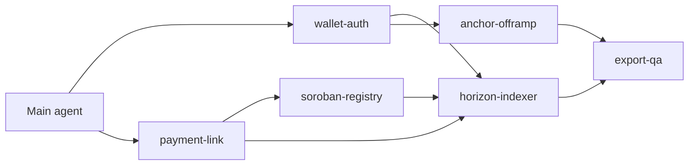

# Subagent Definition (SAD)

**Project:** Syphus
**Date:** 2026-07-06
**Version:** 0.1
**Owner:** Tech lead
**Status:** Draft
**Last reconciled:** N/A (not yet reconciled)
**Sources:** [prd-syphus.md](prd-syphus.md), [sdd-syphus.md](sdd-syphus.md), [qad-syphus.md](qad-syphus.md)

---

## 1. Purpose & Scope

Define 5 development subagents for agentic implementation of Syphus v1. Each agent owns a bounded module with explicit doc traceability. Anti-sprawl: no agent without a PRD-F#, SDD component, or QAD matrix row.

**Platforms:** Cursor (primary), Claude Code via `.claude/agents/`

---

## 2. Roster Design Rationale

| Principle | Application |
|-----------|-------------|
| Least context | Each agent loads only its module + relevant PRD/SDD sections |
| Traceability | Every agent cites PRD-F# or QAD IDs in task brief |
| No overlap | Wallet agent does not touch anchor code |
| Production gate | QA agent runs QAD matrix before merge claims |

---

## 3. The Roster

### Agent 1: `wallet-auth-agent`

**Derives from:** PRD-F1, SDD §3 `users`/`wallets`, QAD-F1-*

**Owns:** Registration, login, session middleware, Stellar keypair provisioning, trustline guidance UI

**Out of scope:** Payment indexing, off-ramp

**Definition of done:** QAD-F1-01 through QAD-F1-04 pass

---

### Agent 2: `payment-link-agent`

**Derives from:** PRD-F2, SDD §4 SEP-7, QAD-F2-*

**Owns:** Payment link generation, public checkout page `/p/:slug`, SEP-7 URI builder

**Out of scope:** Horizon indexing, withdrawals

**Definition of done:** QAD-F2-01 through QAD-F2-04 pass

---

### Agent 2b: `soroban-registry-agent`

**Derives from:** PRD-F9, RFC soroban-registry, QAD-F9-*

**Owns:** `PaymentRegistry` Rust contract, WSL deploy scripts, `packages/stellar/src/soroban.ts`, on-chain status fields, checkout verification badge

**Out of scope:** USDC escrow, replacing SEP-7 flows

**Definition of done:** QAD-F9-01 through QAD-F9-04 pass

---

### Agent 3: `horizon-indexer-agent`

**Derives from:** PRD-F4, SDD §3 indexing flow, QAD-F2-02, QAD-F4-*

**Owns:** Horizon worker, `transactions` table, dashboard payment list API

**Out of scope:** PDF generation UI (hands off to export-agent)

**Definition of done:** Inbound payment appears in dashboard < 60s in staging

---

### Agent 4: `anchor-offramp-agent`

**Derives from:** PRD-F3, RFC anchor orchestration, QAD-F3-*

**Owns:** `AnchorProvider` interface, Coins.ph + BCRemit adapters, health cron, off-ramp wizard

**Out of scope:** User auth, payment links

**Definition of done:** QAD-F3-01 through QAD-F3-04 pass; failover tested

---

### Agent 5: `export-qa-agent`

**Derives from:** PRD-F4 export AC, QAD-F4-*, QAD-SEC-*

**Owns:** CSV/PDF export, date filters, E2E test suite, release checklist

**Out of scope:** New features

**Definition of done:** QAD §6 release criteria green

---

## 4. Orchestration

**Build order:** wallet-auth → payment-link → soroban-registry → horizon-indexer → anchor-offramp → export-qa

Main agent integrates, resolves cross-module conflicts, updates docs on CR.

---

## 5. Materialization (Platform Mapping)

### Cursor

Create rules or Task prompts referencing agent briefs above. Each task includes: PRD-F#, file paths, QAD IDs, out-of-scope list.

### Claude Code

Materialize to `.claude/agents/wallet-auth-agent.md` etc. with same briefs.

### AGENTS.md

BUILD doc materializes project root `AGENTS.md` with read-order and golden paths; subagents defer to it for stack pins.

---

## 6. Maintenance

When PRD-F# changes, update affected agent brief via Change Record. Do not add agents without new PRD-F# or QAD scope.

---

## Self-Check

- [x] 5 agents, each with PRD-F# / QAD citation
- [x] Anti-sprawl: no orphan agents
- [x] Build order defined
- [x] No em-dashes
