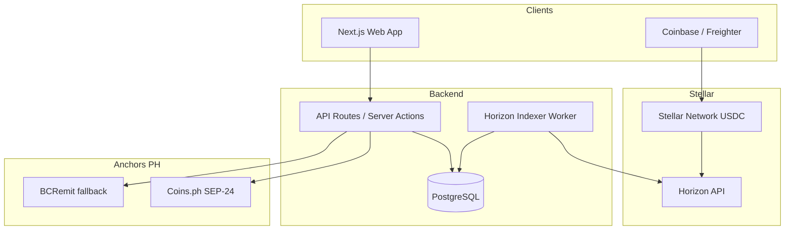

# System Design Document (SDD)

**Project:** Syphus
**Date:** 2026-07-06
**Version:** 1.0
**Owner:** Tech lead
**Status:** Locked
**Last reconciled:** 2026-07-06
**Sources:** [prd-syphus.md](prd-syphus.md)

---

## 1. Architectural Vision & Principles

- **Payment-native:** Stellar is source of truth for inbound USDC; app indexes Horizon, does not custody client funds long-term
- **Anchor abstraction:** Corridor module pattern; PH implements `AnchorProvider` interface (Coins.ph default, BCRemit fallback)
- **Production-grade:** Auth on all sensitive paths; idempotent webhooks; secrets in env only
- **Agent-buildable:** Clear module boundaries for SAD roster

---

## 2. High-Level Architecture

| Component | Realizes | Tech |
|-----------|----------|------|
| Web app | PRD-F1, PRD-F2, PRD-F4 UI | Next.js 15 App Router, TypeScript |
| API layer | PRD-F1-F4 business logic | Server Actions + Route Handlers |
| Horizon indexer | PRD-F4 payment history | Node worker, cursor-based pagination |
| Anchor adapter | PRD-F3 off-ramp | SEP-24 interactive flow |
| Auth | PRD-F1 sessions | Auth.js v5 (`next-auth@5`) with Drizzle adapter on Neon Postgres |

---

## 3. Data Architecture

### Entities

| Table | Purpose | PII |
|-------|---------|-----|
| `users` | Freelancer accounts | email, name |
| `wallets` | Stellar public key, encrypted secret ref | public key only on-chain |
| `payment_links` | SEP-7 link metadata | amount, memo, slug |
| `transactions` | Indexed inbound USDC | tx hash, sender, amount, ts |
| `withdrawals` | Off-ramp session state | anchor session id, status |
| `agencies` | B2B org (v1.1) | company name |

### Indexing flow (PRD-F4)

1. Worker polls Horizon `/accounts/{id}/payments` with cursor
2. Upsert `transactions` idempotently on `transaction_hash`
3. Dashboard reads from DB, not live Horizon (rate limit + latency)

---

## 4. API Design & External Integrations

| Integration | Protocol | PRD-F# | Notes |
|-------------|----------|--------|-------|
| Stellar Horizon | REST | PRD-F4 | Public; fallback server list |
| SEP-7 | URI scheme | PRD-F2 | `web+stellar:pay?...` generation |
| Coins.ph SEP-24 | Interactive | PRD-F3 | Redirect + callback URL |
| BCRemit | SEP-24 | PRD-F3 | Fallback when primary unhealthy |

See [rfc-syphus-anchor-orchestration.md](rfc-syphus-anchor-orchestration.md) for anchor trade-offs.

---

## 5. Security & Authorization

| Path | Control |
|------|---------|
| All `/dashboard/*` | Authenticated session required |
| Wallet secret | Never stored plaintext; use Stellar SEP-10 or client-side signing |
| Off-ramp initiation | User must own wallet; rate limit 5/hour |
| Payment link slug | Unguessable UUID; optional amount cap |
| Webhook callbacks | HMAC verify anchor signatures |
| Input validation | Zod at API boundary |

Money paths: validate Stellar addresses (G... format), memo requirements, minimum amounts before off-ramp.

---

## 6. Infrastructure, CI/CD & Deployment

| Layer | Choice |
|-------|--------|
| Hosting | Vercel (web + serverless) |
| Database | Neon Postgres |
| Worker | Vercel Cron or separate Node service |
| CI | GitHub Actions: lint, test, migrate |
| Environments | dev (testnet), staging (mainnet read), prod (mainnet) |

Deploy: merge to `main` → preview → promote. Rollback via Vercel instant rollback + `ANCHOR_PROVIDER` env flag.

---

## 7. Non-Functional Requirements

| NFR | Target |
|-----|--------|
| Payment visibility latency | < 60s after Stellar confirmation (PRD-F2) |
| API availability | 99.5% monthly |
| Off-ramp completion | < 24h p95 (anchor-dependent) |
| Data retention | Tx history 7 years exportable |
| Concurrent users | 500 v1 |

---

## 8. AI / Agent Architecture

N/A for v1 product. Agentic development uses SAD roster; no runtime AI component.

---

## Self-Check

- [x] PRD-F1 through PRD-F4 mapped in §2 and §4
- [x] Security on money paths in §5
- [x] Rollback in §6
- [x] RFC linked for anchor orchestration
- [x] No em-dashes
