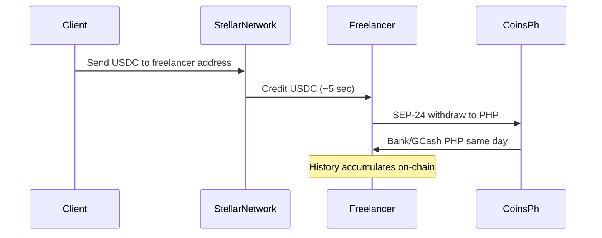

# Gig Payout: Cross-Border Freelancer Payment Rail

**Source ideas:** #10, #39, #68, #295 (Freelancer Money Stack reframed)  
**Validation status:** Evidence-based rank #1. **Gated on Exp 3** before serious GTM spend.  
**Evidence trail:** [freelancer-income-proof.md](../../idea-lab/validation/evidence/freelancer-income-proof.md), [reality-check.md](../../idea-lab/validation/reality-check.md)

---

## One-line thesis

Cross-border freelancers everywhere wait 3–7 days and lose 3–5% to PayPal, Wise, and bank wires. A corridor-replicable Stellar rail pays USDC in seconds and off-ramps to local currency same-day; with income history accruing automatically as a downstream feature, not a standalone product.

---

## The global problem

### Scale

| Metric | Figure (PH beachhead) | Global parallel |
|---|---|---|
| Remote / platform gig workers | 1.5M–2.5M PH freelancers | [Upwork](https://www.upwork.com) 12M+ registered freelancers globally; platform economy ~$455B (World Bank estimates) |
| Payment delay | 3–7 days typical (PayPal, Wise) | Universal complaint across Upwork, Fiverr, direct-client invoicing |
| Payment fees | 3–5% (PayPal cross-border) + FX spread | Same structure globally; Wise/Remitly compete on margin |
| Remote export revenue (PH) | $2–4B annually | India IT exports $250B+; Nigeria, Pakistan, LATAM growing |

**Validation (PH):** Loan rejection without payslips is documented; but the **immediate** pain is getting paid, not proving income later. Cold-start kills standalone income proof; payout must come first.

### Why not a rate-comparison product?

Exp 1 (Jul 2026): Stellar/Coins.ph route ~₱262 **less** than Xoom @ $200 (2.1% worse). Park Stellar-vs-best comparison UI. Gig payout wins on **speed and rail ownership**, not consumer rate shopping.

Exp 6: Only 1–2 live PHP anchors; sufficient for **single-route** payout, not marketplace.

---

## Universal protocol vs country module

### Protocol layer (same everywhere)

| Component | Function |
|---|---|
| **USDC receipt** | Client pays freelancer's Stellar address; 5-second settlement |
| **Corridor off-ramp** | SEP-24/31 anchor converts USDC → local fiat same day |
| **Payment history** | Immutable inbound record → income proof PDF/API (downstream) |
| **Invoice link** | SEP-7 payment request URI for client checkout |

### Country module (corridor-specific)

| Module | Client side | Freelancer side | Anchor |
|---|---|---|---|
| **PH Corridor #1** | US/EU client USDC | PHP via Coins.ph | Coins.ph, BCRemit |
| **IN Corridor** | US/EU client USDC | INR via local anchor | TBD (Stellar anchor map) |
| **NG Corridor** | US/EU client USDC | NGN via local anchor | TBD |
| **LATAM** | US client USDC | MXN/BRL via anchor | TBD |

**Unification:** Client always pays USDC on Stellar. Only the off-ramp varies. Freelancer UX is identical: one address, one history, many corridors.

---

## Target users and jobs-to-be-done

| Segment | Job-to-be-done | Current workaround |
|---|---|---|
| **PH freelancer** | "Get paid same-day with lower fees" | PayPal (3–7 days, 3–5%), Wise, Payoneer |
| **Direct-client freelancer** | "Give client one payment link" | Invoice + PayPal/Wise request |
| **Platform freelancer** | "Withdraw faster than platform schedule" | Platform payout (Upwork 5–10 days) |
| **Client (US/EU)** | "Pay overseas contractor without wire hassle" | PayPal, Wise, Deel, crypto (manual) |

**Beachhead:** Filipino freelancers on Upwork, OnlineJobs.ph, direct US clients; English-friendly, USDC-familiar corridor, Coins.ph ramp exists.

---

## Product definition

### v1 (PH Corridor)

- Freelancer gets Stellar address + SEP-7 payment link / QR.
- Client sends USDC (Stellar).
- Freelancer off-ramps to PHP via Coins.ph (or holds USDC).
- Dashboard: payment history, export CSV/PDF for last 6 months.
- Optional: auto-sweep % to savings account (idea #7 chain).

### v2

- Client-facing checkout page ("Pay [Name]; USDC").
- Income proof API for lenders (feature of payout, not standalone).
- Multi-corridor: add INR, NGN modules.
- Batch payout for agencies paying distributed teams.

### Out of scope (v1)

- Competing with Xoom on remittance rates (Exp 1 FAIL).
- Full tax filing (Gig Pay → BIR chain is v2+).
- Platform integration (Upwork API); requires partnership.

---

## Unique value proposition

> **"Same-day pay, same address, anywhere your clients are."**  
> Client pays digital dollars in seconds; you receive local currency today; and every payment builds your proof of income automatically.

**Differentiation vs incumbents:**

| | PayPal / Wise | Gig Payout |
|---|---|---|
| Settlement | 1–7 days | ~5 seconds on-chain |
| Income record | Platform export (manual) | Automatic immutable history |
| Client UX | Account required | Payment link / address |
| Rate | FX spread + fee | Transparent USDC; local ramp fee only |
| Cross-corridor | New setup per country | Same Stellar address; swap ramp module |

---

## Business Model Canvas

| Block | Content |
|---|---|
| **Customer segments** | Cross-border freelancers (PH wedge 1.5M+); direct-client workers; small agencies paying remote teams |
| **Value propositions** | Same-day settlement; lower total cost vs PayPal; automatic income history; one payment address globally |
| **Channels** | OnlineJobs.ph / Upwork PH communities; freelancer Facebook groups; dev/design agency referrals |
| **Customer relationships** | Self-serve wallet + ramp; optional concierge for first payout |
| **Revenue streams** | Off-ramp spread share with anchor; freemium (free under $X/month); premium income-proof export; future B2B agency batch fees |
| **Key resources** | Anchor partnerships per corridor; SEP-7/24 integration; compliance/KYC flow |
| **Key activities** | Corridor onboarding; anchor maintenance; freelancer education ("USDC = digital dollars") |
| **Key partners** | Coins.ph, BCRemit (PH); future anchors per corridor; freelancer communities |
| **Cost structure** | Anchor fees; KYC; support; Stellar network fees (minimal) |

---

## Stellar architecture

### Primitives

| Primitive | Use |
|---|---|
| **USDC (Stellar)** | Client payment asset |
| **SEP-7** | Payment request URIs for clients |
| **SEP-24 / anchor** | Fiat off-ramp to PHP |
| **Horizon** | Transaction history → income export |

### Flow

---

## Regulatory and risk notes

| Topic | Note |
|---|---|
| BSP VASP | Off-ramp via licensed anchor (Coins.ph). Freelancer completes KYC at anchor. |
| Client side | US clients: USDC transfer may be MSB/reporting context; use established USDC issuers. |
| Tax | On-chain history supports BIR reporting; not tax advice. v1 = export only. |
| Anchor concentration | Exp 6 CAUTION; 1–2 PHP anchors. Single-route OK; no marketplace dependency. |

---

## Replication playbook; 5 questions per corridor

1. **Anchor:** Is there a live SEP-24 Stellar anchor for local fiat?
2. **Freelancer density:** Are there ≥100K remote workers receiving foreign currency?
3. **Incumbent pain:** Is PayPal/Wise delay ≥2 days and fee ≥2%?
4. **Client currency:** Can clients source USDC (crypto-native or on-ramp)?
5. **Compliance:** Does local law permit stablecoin receipt + anchor off-ramp for individuals?

**Kill per corridor:** No anchor + Exp 3-equivalent survey <25% willingness → defer corridor.

---

## Go-to-market wedge

### Gate: Experiment 3

Run before marketing spend ([human-runbook](../../idea-lab/validation/experiments/human-runbook.md)):

- **Kill:** <5/20 freelancers say yes to USDC/Stellar payout.
- **Pass:** ≥10/20 yes **and** ≥10/20 currently wait 3+ days.

### Phase 1 (post-Exp 3 pass)

- 10-freelancer concierge: set up address, one client payment, one off-ramp.
- Measure: time to PHP, fee vs PayPal, repeat use.

### Phase 2

- Payment link generator; public landing for "Get paid like a global contractor."
- Income export button (6-month PDF).

---

## Success metrics

| Metric | Target |
|---|---|
| Exp 3 pass | ≥10/20 yes, ≥10/20 wait 3+ days |
| Concierge repeat | 50%+ second payout within 30 days |
| Time to PHP | <24h from client send |
| Fee savings vs PayPal | Document ≥1% on $500 payment |
| Income export usage | 20%+ generate PDF within 90 days |

---

## Open questions and kill conditions

| Condition | Action |
|---|---|
| Exp 3 fail | **Park gig payout**; stay on wage lock |
| Anchor offline / Coins.ph policy change | Backup BCRemit; corridor pause |
| Freelancers won't ask clients to pay USDC | Pivot to agency-paid batch only |
| Lenders reject Stellar history (Exp 4 analog) | Income proof stays export-only, not credit product |

**Sequencing insight from validation:** Build payout first → income proof becomes feature. Do not build standalone Stellar income proof.

---

## Related

- [Portfolio README](../../README.md); project overview and ranking
- [Wage Lock](../../wage-lock/docs/spec.md); primary build (no Exp 3 gate)
- [idea-lab/validation/evidence/freelancer-income-proof.md](../../idea-lab/validation/evidence/freelancer-income-proof.md); cold-start analysis
